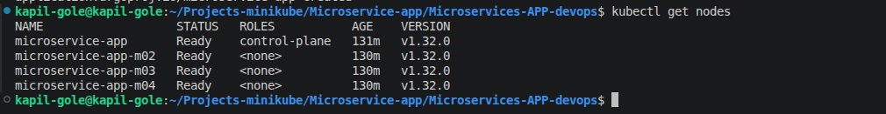
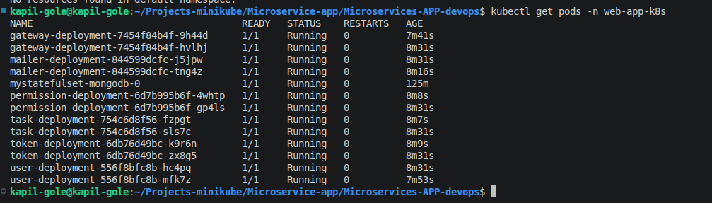
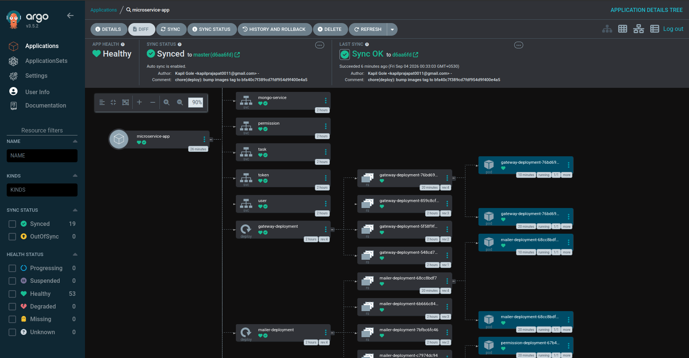

# Microservices Application: DevOps and Kubernetes

This repository demonstrates how to package, test, publish, and deploy a NestJS microservices application using DevOps tools.

The application is a task-management API with user registration, email confirmation, authentication, permissions, and task management.

## Deployment Screenshots

The following screenshots show the local Kubernetes and Argo CD deployment successfully running.

### Kubernetes Nodes

All Minikube control-plane and worker nodes are in the `Ready` state.



### Application Pods

The gateway, microservices, and MongoDB pods are running successfully in the `web-app-k8s` namespace.



### Argo CD Application

Argo CD reports the application as `Healthy` and `Synced` with the Git repository.



## Attribution

The NestJS web application and microservices code are based on the original project by **Denrox**:

- Original project: <https://github.com/Denrox/nestjs-microservices-example>

The following DevOps implementation is my work by **Kapil Gole**:

- Dockerfiles and container image workflow
- Docker Compose configuration
- Kubernetes cluster setup and node-role labeling
- Kubernetes Deployments, Services, Secrets, ConfigMaps, StatefulSet, and storage
- Kustomize configuration
- GitHub Actions CI/CD workflow
- Docker Hub image publishing
- Argo CD GitOps deployment configuration
- Troubleshooting, dependency fixes, and deployment validation

## Architecture

The system contains these services:

- **API Gateway**: public HTTP API and Swagger documentation
- **User service**: user registration, confirmation, and user operations
- **Token service**: JWT creation, decoding, and destruction
- **Permission service**: permission checks
- **Task service**: task CRUD operations
- **Mailer service**: confirmation email delivery
- **MongoDB**: database used by the services

The internal microservices communicate through TCP sockets. The project uses one MongoDB instance to keep the example simple. A larger production system would normally give each service ownership of its database.

### Service Table

| Component | Kubernetes resource | Port | Purpose |
| --- | --- | ---: | --- |
| Gateway | Deployment and Service | 8000 | Public HTTP API and Swagger |
| Task | Deployment and Service | 8001 | Task operations |
| Token | Deployment and Service | 8002 | JWT operations |
| User | Deployment and Service | 8003 | User operations |
| Mailer | Deployment and Service | 8004 | Confirmation email delivery |
| Permission | Deployment and Service | 8005 | Permission checks |
| MongoDB | StatefulSet and headless Service | 27017 | Persistent application database |

## DevOps Tools Demonstrated

### Docker and Docker Compose

Each NestJS service has its own Dockerfile. The application is compiled while the image is built, and the container starts the compiled application with `npm run start:prod`.

Docker Compose runs the complete application locally, including MongoDB, the gateway, and all microservices.

### Kubernetes and Minikube

Kubernetes manages Deployments for stateless services, a StatefulSet for MongoDB, ClusterIP Services, ConfigMaps, Secrets, and persistent storage. Minikube provides a local four-node Kubernetes cluster using Docker. The cluster script labels nodes for frontend, backend, and database workloads.

### Kustomize

Kustomize groups the Kubernetes resources in `k8s-manifests/kustomization.yaml` and replaces image tags with an exact Git commit SHA. This makes deployments reproducible instead of relying only on `latest`.

### GitHub Actions

The workflow in `.github/workflows/ci.yml` installs dependencies, builds and publishes Docker images, tags images with `latest` and the Git commit SHA, updates Kustomize image tags, and commits the manifest update back to GitHub. It supports push, pull request, and manual `workflow_dispatch` execution.

### Argo CD

Argo CD watches the `k8s-manifests` directory on the `master` branch and synchronizes it with Kubernetes. When CI updates an image tag in Git, Argo CD detects the change and deploys the new version.

## Kubernetes Resource Reference

| Resource | File or location | Role |
| --- | --- | --- |
| Namespace | `namespace.yaml` | Provides the `web-app-k8s` namespace |
| ConfigMaps | `config.yaml`, `database/mongo-config.yaml` | Store non-sensitive ports, hosts, and database settings |
| Secrets | `secret.yaml`, `database/mongo-secret.yaml` | Store JWT, mail, and MongoDB credentials |
| Deployments | `*-deployment.yaml` | Run the stateless microservices with two replicas |
| Services | `*-service.yaml` | Provide stable internal DNS names and ports |
| MongoDB StatefulSet | `database/mongodb-statefulset.yaml` | Run MongoDB with stable identity and persistent storage |
| MongoDB PVC | `volumeClaimTemplates` in the StatefulSet | Request 10 GiB of persistent storage |
| Argo CD Application | `argocd-application.yaml` | Connect Argo CD to this Git repository and path |
| Kustomization | `kustomization.yaml` | Assemble resources and set image tags |

## Configuration and Key Management

Kubernetes configuration is separated into two categories:

- **ConfigMap**: non-sensitive values such as ports, service DNS names, and feature flags.
- **Secret**: sensitive values such as passwords, JWT signing keys, and mail credentials.

### Non-sensitive ConfigMap Keys

| Key | Resource | Example value | Used for |
| --- | --- | --- | --- |
| `MONGO_DATABASE` | `app-config`, `mongodb-config` | `testdb` | Database name |
| `MONGO_HOST` | `mongodb-config` | `mongo-service` | MongoDB Service DNS name |
| `MONGO_PORT` | `mongodb-config` | `27017` | MongoDB port |
| `API_GATEWAY_PORT` | `app-config` | `8000` | Gateway listening port |
| `TASK_SERVICE_PORT` | `app-config` | `8001` | Task service port |
| `TASK_SERVICE_HOST` | `app-config` | `task` | Task Service DNS name |
| `TOKEN_SERVICE_PORT` | `app-config` | `8002` | Token service port |
| `TOKEN_SERVICE_HOST` | `app-config` | `token` | Token Service DNS name |
| `USER_SERVICE_PORT` | `app-config` | `8003` | User service port |
| `USER_SERVICE_HOST` | `app-config` | `user` | User Service DNS name |
| `MAILER_SERVICE_PORT` | `app-config` | `8004` | Mailer service port |
| `MAILER_SERVICE_HOST` | `app-config` | `mailer` | Mailer Service DNS name |
| `PERMISSION_SERVICE_PORT` | `app-config` | `8005` | Permission service port |
| `PERMISSION_SERVICE_HOST` | `app-config` | `permission` | Permission Service DNS name |
| `BASE_URI` | `app-config` | `http://localhost` | Application base URL |
| `MAILER_DISABLED` | `app-config` | `0` or `1` | Enable or disable mail delivery |

### Secret Keys

| Key | Resource | Used for |
| --- | --- | --- |
| `JWT_SECRET` | `app-secret` | Signs and verifies JWT tokens |
| `MAILER_DSN` | `app-secret` | SMTP connection string |
| `MAILER_FROM` | `app-secret` | Sender address for email |
| `MONGO_INITDB_ROOT_USERNAME` | `mongo-secret` | MongoDB root username |
| `MONGO_INITDB_ROOT_PASSWORD` | `mongo-secret` | MongoDB root password |
| `MONGO_DSN` | `mongo-secret` | Authenticated MongoDB connection string |

### Secret Management Rules

The repository currently uses `stringData` for local learning. Kubernetes converts `stringData` into a Secret object, but it does not encrypt values in Git. Follow these rules for real environments:

1. Never commit real passwords, SMTP credentials, JWT keys, or connection strings.
2. Rotate any credentials that have already been committed to a public or shared repository.
3. Use GitHub Actions Secrets for CI credentials such as `DOCKERHUB_USERNAME` and `DOCKERHUB_TOKEN`.
4. Use a secret manager such as AWS Secrets Manager, External Secrets Operator, Sealed Secrets, or Vault for production Kubernetes secrets.
5. Restrict access with Kubernetes RBAC and enable encryption at rest in the cluster.
6. Do not print secrets in logs or expose them through `kubectl describe`, screenshots, or debug output.

For local testing, create secrets manually instead of committing values:

```bash
kubectl create secret generic app-secret -n web-app-k8s \
	--from-literal=JWT_SECRET="$JWT_SECRET" \
	--from-literal=MAILER_DSN="$MAILER_DSN" \
	--from-literal=MAILER_FROM="$MAILER_FROM"

kubectl create secret generic mongo-secret -n web-app-k8s \
	--from-literal=MONGO_INITDB_ROOT_USERNAME="$MONGO_ROOT_USER" \
	--from-literal=MONGO_INITDB_ROOT_PASSWORD="$MONGO_ROOT_PASSWORD" \
	--from-literal=MONGO_DSN="$MONGO_DSN"
```

## Repository Layout

```text
.
├── gateway/                    # API gateway service
├── mailer/                     # Email service
├── permission/                 # Permission service
├── task/                       # Task service
├── token/                      # Token service
├── user/                       # User service
├── db/                         # MongoDB initialization files
├── k8s-manifests/              # Kubernetes and Argo CD manifests
├── .github/workflows/ci.yml    # GitHub Actions pipeline
├── docker-compose.yml          # Local application environment
└── docker-compose.test.yml     # Integration-test environment
```

## Requirements

- Docker and Docker Compose
- Node.js 18 or newer
- npm
- kubectl
- Minikube
- Git

Argo CD is required for the GitOps deployment section.

## Run Locally with Docker Compose

```bash
docker network create infrastructure 2>/dev/null || true
cp .env.example .env
docker compose up -d --build
```

The API gateway is available at <http://localhost:8000> and Swagger is available at <http://localhost:8000/api>.

Stop the local environment:

```bash
docker compose down
```

## Run Tests

```bash
cp .env.test.example .env.test
docker compose -f docker-compose.test.yml up -d --build
cd gateway
npm install --legacy-peer-deps
npm run test
cd ..
```

## Create the Local Kubernetes Cluster

Run these commands from `k8s-manifests`:

```bash
cd k8s-manifests
chmod +x Script-create-cluster.sh
./Script-create-cluster.sh
kubectl config use-context microservice-app
kubectl get nodes -o wide -L role
kubectl cluster-info
```

The script creates the `microservice-app` Minikube profile with one control-plane node and three worker nodes. The worker nodes are labeled `frontend`, `backend`, and `database`.

## Deploy with Kubernetes and Kustomize

From `k8s-manifests`:

```bash
kubectl apply -k .
kubectl get pods -n web-app-k8s -o wide
kubectl get deployments,statefulsets -n web-app-k8s
kubectl get svc -n web-app-k8s
```

Check rendered images:

```bash
kubectl kustomize . | grep -E '^\s+image:'
```

Access the gateway locally:

```bash
kubectl port-forward -n web-app-k8s svc/gateway-service 8000:8000
```

Open <http://localhost:8000/api> for Swagger.

## Install and Configure Argo CD

```bash
kubectl create namespace argocd
kubectl apply -n argocd \
	-f https://raw.githubusercontent.com/argoproj/argo-cd/stable/manifests/install.yaml
kubectl get pods -n argocd
kubectl apply -f k8s-manifests/argocd-application.yaml
kubectl get application microservice-app -n argocd -o wide
```

The Argo CD Application watches:

```text
Repository: https://github.com/kapilgole1/Microservices-APP-devops.git
Branch: master
Path: k8s-manifests
Namespace: web-app-k8s
```

Access the Argo CD web interface:

```bash
kubectl port-forward svc/argocd-server -n argocd 8080:443
```

Open <https://localhost:8080>. Retrieve the initial admin password with:

```bash
kubectl -n argocd get secret argocd-initial-admin-secret \
	-o jsonpath="{.data.password}" | base64 -d; echo
```

## CI/CD Configuration

Add these GitHub repository secrets:

- `DOCKERHUB_USERNAME`
- `DOCKERHUB_TOKEN`

The workflow uses `contents: write` permission to update image tags in the repository. Run it manually from **GitHub Actions > Node.js Microservices CI > Run workflow**.

### CI/CD Flow

| Stage | Tool | Result |
| --- | --- | --- |
| Source change | GitHub | Starts CI on a push, pull request, or manual dispatch |
| Dependency installation | GitHub Actions and npm | Installs each service's dependencies |
| Image build | Docker Buildx | Builds six microservice images |
| Image publication | Docker Hub | Publishes `latest` and commit-SHA tags |
| Manifest update | Kustomize | Replaces image tags with the commit SHA |
| GitOps deployment | Argo CD | Detects the Git change and syncs Kubernetes |

The CI workflow needs these permissions and secrets:

| Name | Type | Purpose |
| --- | --- | --- |
| `DOCKERHUB_USERNAME` | GitHub Secret | Docker Hub account or organization |
| `DOCKERHUB_TOKEN` | GitHub Secret | Docker Hub authentication token |
| `contents: write` | Workflow permission | Allows CI to commit updated manifests |

Manual runs use `workflow_dispatch`. Image publishing must allow both push and manual events:

```yaml
if: github.event_name == 'push' || github.event_name == 'workflow_dispatch'
```

## Troubleshooting

```bash
kubectl get pods -n web-app-k8s
kubectl get events -n web-app-k8s --sort-by=.lastTimestamp
kubectl describe pod <pod-name> -n web-app-k8s
kubectl logs <pod-name> -n web-app-k8s
kubectl logs <pod-name> -n web-app-k8s --previous
```

Check Argo CD synchronization:

```bash
kubectl get application microservice-app -n argocd -o wide
kubectl describe application microservice-app -n argocd
kubectl get pods -n argocd
```

The expected Argo CD result is `Synced` with health `Healthy`.

If MongoDB is pending, check its node selector and labels:

```bash
kubectl get nodes --show-labels
kubectl describe pod mystatefulset-mongodb-0 -n web-app-k8s
```

MongoDB requires:

```yaml
nodeSelector:
	role: database
```

## Remove the Local Cluster

```bash
minikube delete -p microservice-app
```

## Learning Outcomes

This project provides practical experience with containerizing services, building reproducible images, managing Kubernetes workloads, scheduling with node selectors, handling secrets and persistent storage, using Kustomize, automating CI/CD with GitHub Actions, publishing images to Docker Hub, applying GitOps with Argo CD, and debugging deployments.
